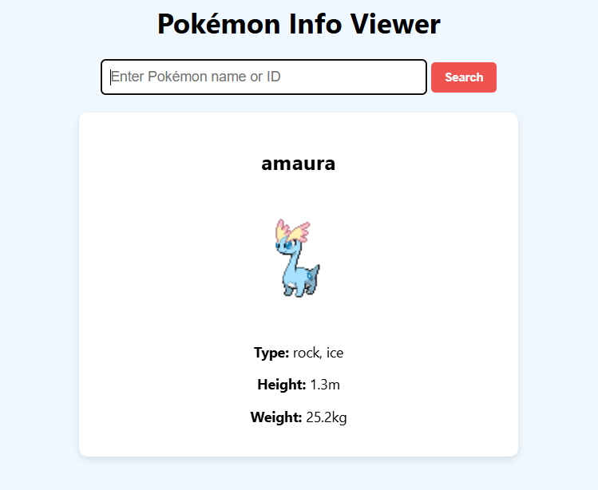

# Pokémon Viewer

A simple **Pokédex-style web app** built using **vanilla JavaScript** and the **PokéAPI**. Search for any Pokémon and view its name, types, height, weight, and image.

## Features

- 🧑‍💻 **Search** for any Pokémon by name.
- 🐾 View **types** of the Pokémon (e.g., Fire, Water).
- 🏋️‍♂️ See **height** and **weight** (converted to meters and kilograms).
- 🖼️ Display Pokémon **image** from the API.

## Screenshots



> Replace `path/to/your/screenshot.png` with an actual screenshot of your app.

## How It Works

1. **Enter a Pokémon name** into the search bar.
2. **Click the "Search" button** or press Enter to trigger the search.
3. The app fetches data from the [PokéAPI](https://pokeapi.co/).
4. Displays:
    - Pokémon’s **name**
    - Pokémon’s **types**
    - Pokémon’s **height** and **weight** (in meters and kilograms)
    - **Image** of the Pokémon

## Technologies Used

- **HTML** – Markup for the page
- **CSS** – Styling for the user interface
- **JavaScript (Vanilla)** – To fetch data from the PokéAPI and manipulate the DOM
- **PokéAPI** – Provides the data about Pokémon (https://pokeapi.co/)

## Getting Started

To run this project locally:

1. **Clone the repository:**

    ```bash
    git clone https://github.com/yourusername/pokemon-viewer.git
    ```

2. **Navigate to the project directory:**

    ```bash
    cd pokemon-viewer
    ```

3. **Open the `index.html` file** in your browser.
